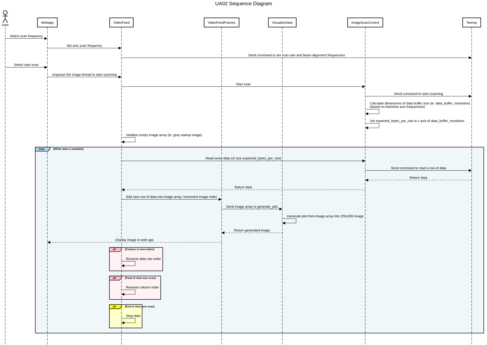

# UBC AweSEM Control

Web application to control the hardware for the UBC AweSEM device.

Deployed on (as of December 1, 2019):

- Raspberry Pi 4
- Raspbian 10 Buster
- Python 3.7.3

## Getting Started: End Users

### Connecting to the Web App

Wifi access point credentials:

- SSID: `UBC AweSEM`
- Password: `ubcawesem`

Instructions:

1. Boot up the Raspberry Pi
2. From your laptop, select the wifi access point
3. Once connected, open your browser (ie. Google Chrome) and navigate to `http://ubcawesem.local/`
4. Enjoy!

### Updating the Web App

If updates are required, connect to the Pi's wifi access point and execute the following commands (on your laptop):

```bash
# Pull the latest changes from the repository
git checkout master
git pull

cd bin/
# Install the latest files to the Pi
./rsync.sh --install
```

## Getting Started: Developers

Instructions below are for developing the web application. The workflow is as follows:

1. Set up the repository on your laptop
2. Optional: Test the web app locally (ie. if making changes to how the web app looks, it doesn't need to be connected to the hardware)
3. Connect to the Raspberry Pi (either through the Pi's wifi access point or through an ethernet cable from your laptop to the Pi)
4. Execute the following to push files from your laptop to the pi:

```bash
cd bin/

# Will push all files once. Omit the flag to keep it running and continually sync files from your laptop to the pi
./rsync.sh --once
```

Note: On the Pi, the web application is served as a system daemon. If you plan on making/testing changes to the web app on the Pi, **please stop the web app service to ensure only one instance of the web app is running**. If not, this may cause resource conflicts as now two instantiations will be requesting control of the hardware. To do this:

```bash
# Stop/start the web app service (ie. if you want to run the web app manually)
sudo systemctl stop awesem-webapp.service
sudo systemctl start awesem-webapp.service
```

Other useful commands:

```bash
# Check the status of the web app
systemctl status awesem-webapp.service

# Check the service file logs (ie. if something goes wrong)
journalctl -u awesem-webapp.service

# View the continually updating logs
journalctl -u awesem-webapp.service -f
```

### Prerequisites

- Python 3.6.8 or greater
- Optional: [virtualenv](https://virtualenv.pypa.io/en/latest/)

### Installation

The web application can be developed and tested locally (ie. no hardware is required). To set it up on your own machine:

```bash
# Optional: Create a virtual environment named "env" and activate it
virtualenv env -p python3
source env/bin/activate

# Install the package (within the virtual environment, if desired)
pip3 install -e .
```

### Usage

To run the new web-based GUI (locally):

```bash
# Optional: Enable debug mode/reloader
export FLASK_DEBUG=true

cd webapp
python3 run.py
```

When the web app is run locally, the following occurs:

- Image scan is replaced with random noise
- Hardware control is replaced with log messages with hardware mocked (example below)

```
2019-12-01 22:18:03.517 | DEBUG    | webapp.api.general:electron_beam_on:32 - Turning system on
2019-12-01 22:18:03.517 | DEBUG    | awesem.high_voltage_control:switch_ultravolt_output_signal:47 - Setting ultravolt output signal: 1
2019-12-01 22:18:03.518 | INFO     | awesem.drivers.relays:on:51 - Mock: Turning on
2019-12-01 22:18:03.518 | DEBUG    | awesem.high_voltage_control:switch_enable_signal:29 - Setting enable signal: 1
2019-12-01 22:18:03.518 | INFO     | awesem.drivers.relays:on:51 - Mock: Turning on
2019-12-01 22:18:03.519 | DEBUG    | awesem.high_voltage_control:switch_ultravolt_power:38 - Setting ultravolt power: 1
2019-12-01 22:18:03.519 | INFO     | awesem.drivers.relays:on:51 - Mock: Turning on
2019-12-01 22:18:03.519 | DEBUG    | awesem.high_voltage_control:set_ultravolt_output_control_signal:56 - Setting control signal with 2.71 V
2019-12-01 22:18:03.519 | INFO     | awesem.drivers.digital_potentiometers:_set_amplitude:77 - Mock: Device 45, RDAC 2, Amplitude 2.71
2019-12-01 22:18:03.520 | DEBUG    | awesem.laser_control:power:18 - Setting power: 1
2019-12-01 22:18:03.520 | INFO     | awesem.drivers.relays:on:51 - Mock: Turning on
2019-12-01 22:18:03.521 | INFO     | webapp.configs:save_config:29 - Saved to /home/jlam/Documents/ua02-ubc-awesem/ua02-awesem-control/webapp/config.ini
2019-12-01 22:18:03.521 | INFO     | webapp.api.general:electron_beam_on:44 - All systems powered on
```

These files are in `awesem/drivers` (ie. `analog_digital_converter.py`, `digital_potentiometers.py`, `relays.py`). See instances where `is_machine_raspberry_pi()` is used.

### Documentation

Documentation is built using sphinx. To generate the documentation:

```bash
cd docs/
make html
```

To view the documentation, open the following file in your browser:

```
docs/_build/html/index.html
```

A sequence diagram of the image generation method is show below:



# Legacy

To run the original GUI:

```bash
cd awesem/qtgui
python3 testbench_main.py
```

# Contributors

- Justin Lam
- Chuan Du
